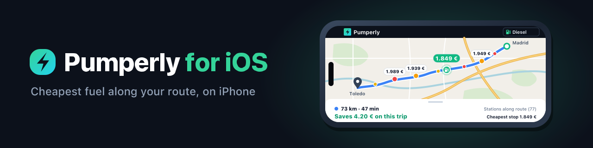
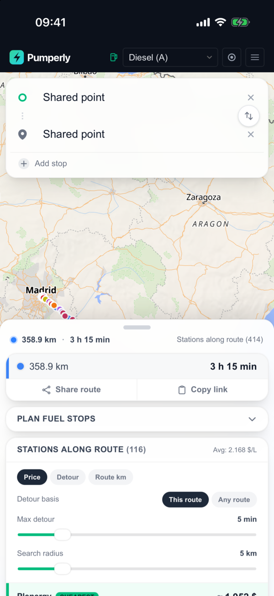
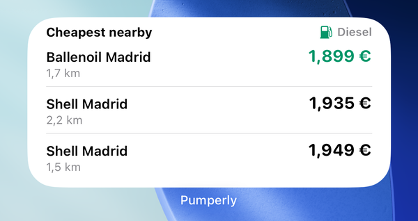
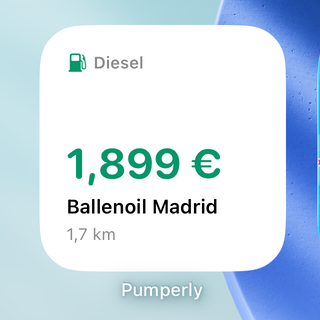
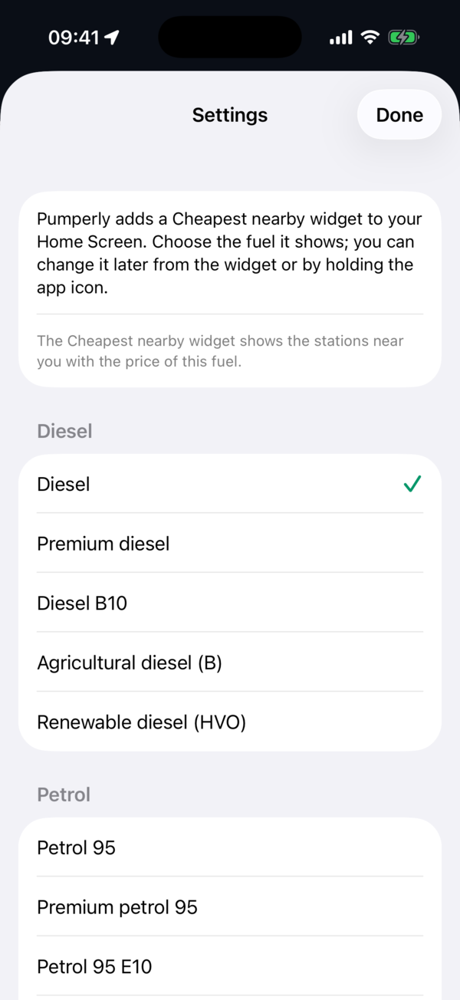
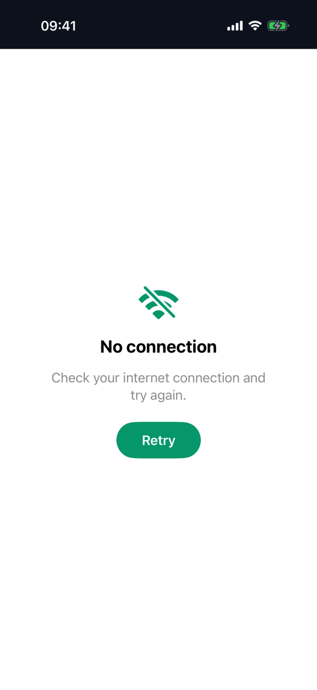

<p align="center">
  
</p>

<h1 align="center">Pumperly for iOS</h1>

<p align="center">
  <a href="https://github.com/GeiserX/pumperly-ios/actions/workflows/ci.yml"></a>
  <a href="LICENSE"></a>
</p>

Pumperly for iOS is the iPhone app for [Pumperly](https://pumperly.com), the open-source fuel and EV route planner that finds the cheapest place to refuel along your route. It shows the web app in a native SwiftUI shell and adds what a phone can do better than a tab: a "Cheapest nearby" widget for the Home Screen, the Lock Screen and the Apple Watch, Siri and Shortcuts, and an offline memory of the stations around you. The first builds go to TestFlight, then to the App Store.

<p align="center">
  
  
  
</p>

## Features

- The full Pumperly route planner, with fuel and EV prices along the route, from the live site.
- A "Cheapest nearby" widget in small and medium sizes: the cheapest of the 50 nearest stations within 10 km for your fuel, refreshed about hourly. Tapping a station opens its page in the app.
- One native setting, the widget's fuel, asked once on first launch and reachable from the widget or by holding the app icon.
- Siri, Shortcuts and Spotlight: ask for the cheapest fuel near you, change the widget fuel, or go back to Pumperly, without opening a screen first.
- Lock Screen widgets in the circular, rectangular and inline sizes, with the cheapest price around you.
- An Apple Watch app with the three cheapest stations nearby, plus complications for the watch face. The fuel follows the iPhone.
- Works offline: the app and the widget show the last known cheapest stations nearby, with the time they were fetched.
- CarPlay support is in the code and switched on once Apple grants the fueling entitlement.
- Native location: the site and the widget share one iOS permission, and only pumperly.com pages can read it.
- Only `https://pumperly.com` loads inside the app; every other link opens in Safari or the app that owns it.
- Universal links: pumperly.com links open in the app once it is installed.
- Offline, certificate and page error screens with retry, pull to refresh, a progress bar and dark mode that follows the system.
- English and Spanish.

<p align="center">
  
  
</p>

## Quick start

You need Xcode 16 or newer and [XcodeGen](https://github.com/yonaskolb/XcodeGen). The Xcode project is generated from `project.yml` and is not committed.

```bash
brew install xcodegen
xcodegen generate
open Pumperly.xcodeproj
```

Run the `Pumperly` scheme on an iPhone simulator. This runs the unit and UI tests on the newest installed iPhone simulator, as CI does on every pull request:

```bash
xcodebuild test -project Pumperly.xcodeproj -scheme Pumperly \
  -destination "platform=iOS Simulator,id=$(scripts/pick-simulator.sh)" -parallel-testing-enabled NO
```

## Release

`project.yml` holds the version (`MARKETING_VERSION`) and the build number (`CURRENT_PROJECT_VERSION`); bump the build number for every upload. Pushing a tag `vX.Y.Z` that matches the version runs `.github/workflows/release.yml`, which archives with manual signing and uploads the build to TestFlight. It needs these repository secrets:

| Secret | Contents |
|---|---|
| `APPSTORE_ISSUER_ID` | App Store Connect API issuer id |
| `APPSTORE_KEY_ID` | App Store Connect API key id |
| `APPSTORE_PRIVATE_KEY` | The key's `.p8` file, as text |
| `DIST_CERTIFICATE_P12` | Apple Distribution certificate and private key, `.p12` in base64 |
| `DIST_CERTIFICATE_PASSWORD` | Password of that `.p12` |
| `PROFILE_APP` | App Store profile "Pumperly App Store" for `com.pumperly.app`, base64 |
| `PROFILE_WIDGET` | App Store profile "Pumperly Widget App Store" for `com.pumperly.app.widget`, base64 |
| `PROFILE_WATCH_APP` | App Store profile "Pumperly Watch App Store" for `com.pumperly.app.watchkitapp`, base64 |
| `PROFILE_WATCH_WIDGET` | App Store profile "Pumperly Watch Widget App Store" for `com.pumperly.app.watchkitapp.widget`, base64 |

All four profiles need the App Group `group.com.pumperly.app`; the app's profile also needs Associated Domains.

## Related projects

[Pumperly](https://github.com/GeiserX/Pumperly) (the web app), [Pumperly for Android](https://github.com/GeiserX/Pumperly-android), [pumperly-mcp](https://github.com/GeiserX/pumperly-mcp), [pumperly-ha](https://github.com/GeiserX/pumperly-ha).

## License

[GPL-3.0-only](LICENSE)
